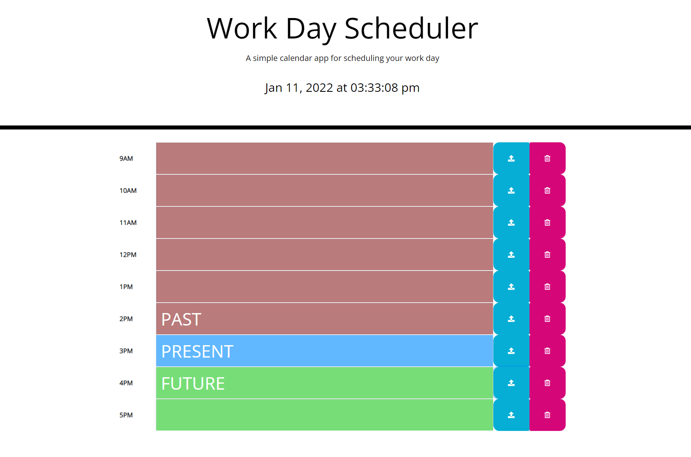
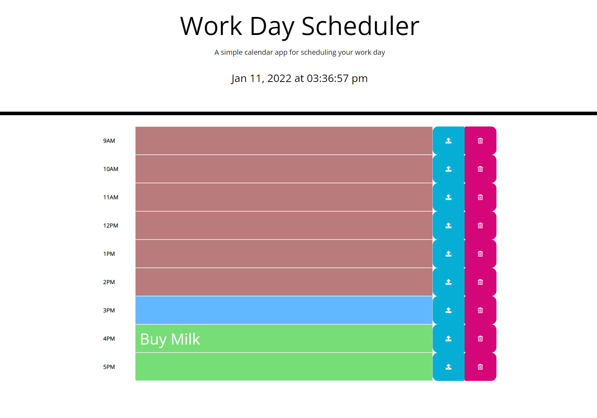

# RANDOM PASSWORD GENERATOR

---

## Motivation

The motivation behind this project is a practicality, and help people manage their working hour be more efficient and neat by using this working hour planner. So this application will come really handy for people that wan to make sure they use their time wisely and as reminder.

---
## Installation

The Installation of this webpage will be straight forward simply click the links below or 
copy the links to the browser you are going to use, to achieve the best experience of 
this website make sure you are using desktop.

Github link is provided to further check and test.

* Webpage Link
https://tirtasty.github.io/Daily-Planner/

* Github Link
https://github.com/tirtasty/Daily-Planner.git

---

## Usage

** Once you launch the page, current day and time will appear (Sydney Time or based on location you are at). Each colour represent current situation which peach colour represent past, blue represent present, and green represent future time.

** And the as its functionality, fill the coloumn based on what you are going to plan to each hour and simply click the save button on the right side of text area and when you think it is done you could delete by click the remove button to each coloumn you want to remove and it does remove on display and from local data.

** This the demo how the app will works

---
## Contributors

- Tirta Styadi - <tirta.setiady@yahoo.com>

---

##

© Tirta Styadi, University Of Sydney Coding Bootcamp